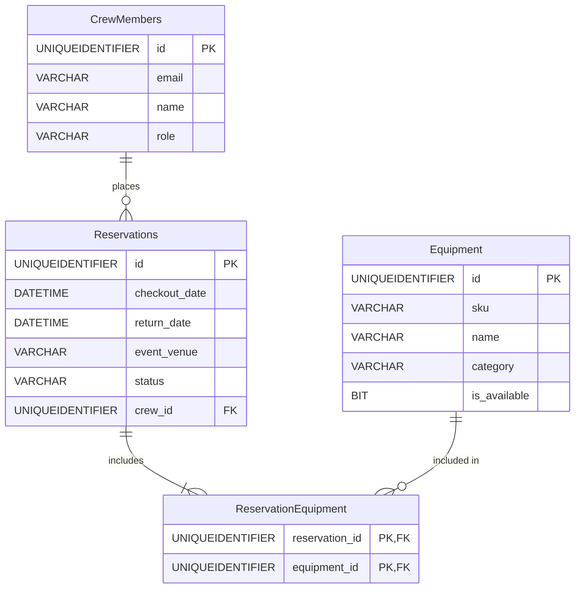

# ITMD544 - API Development Assignment
## Professional A/V Equipment Vault API

REST and GraphQL backend API for managing audio/visual equipment vault. This project is the first part to the final assignment and is deployed to Azure. It focuses on cloud deployment, database integration using Node.js and Azure SQL, and advanced API features.

**Live GraphQL API:** [https://itmd544-apidev-h9f0h3gderesc3b0.westus3-01.azurewebsites.net/graphql](https://itmd544-apidev-h9f0h3gderesc3b0.westus3-01.azurewebsites.net/graphql)  
**GitHub Repository:** [https://github.com/DominikFX/ITMD544-api-dev](https://github.com/DominikFX/ITMD544-api-dev)

## Features & Implementation (Phases 1 & 3)

This project combines Phase 1 (Database Integration) and Phase 3 (GraphQL API Implementation) requirements:
- **Direct Database Access:** Utilizes the `mssql` (ADO.NET equivalent for Node.js) package to connect to an Azure SQL Serverless database without using an ORM.
- **Relational Schema:** Has a multi-table relational structure with cross-table relationships.
- **REST & GraphQL:** Offers an API alongside a GraphQL engine (Express and Apollo Server).
- **Limitations:** Implemented retry logic on database connections to handle since the free tier of Azure SQL Database needs time to "wake up". If the app does not load, try refreshing the page.

## Tech Stack

- **Runtime:** Node.js / TypeScript
- **Server:** Express.js + Apollo Server
- **Database:** Azure SQL Database (Serverless, Free Tier)
- **Deployment:** Azure App Service (Web App)

## System Architecture & Endpoints

- `GET /` - API Status & Version
- `GET /docs` - Interactive Swagger UI Documentation
- `POST /graphql` - Apollo Server GraphQL Endpoint
- **API Endpoints:** `/crew`, `/equipment`, `/reservations`, `/reset`

## Database Schema

The database consists of the following core tables:

1. **CrewMembers**: Information regarding internal staff (ID, email, name, role).
2. **Equipment**: Available A/V gear inventory (ID, sku, name, category, is_available).
3. **Reservations**: Checkout and return dates mapped to a specific CrewMember and Event Venue.
4. **ReservationEquipment**: A combo table linking multiple Equipment items to a single Reservation.



## Local Setup Instructions

1. **Clone the repository:**
   ```bash
   git clone https://github.com/DominikFX/ITMD544-api-dev.git
   cd ITMD544-api-dev
   ```

2. **Install Dependencies:**
   ```bash
   npm install
   ```

3. **Configure the Environment:**
   Create a `.env` file in the root of the project using the `.env.example` template:
   ```bash
   cp .env.example .env
   ```
   *Replace the placeholders in the `.env` file with Azure SQL credentials. Also, add your current local IP address to the Azure Portal Firewall settings if running locally.*

4. **Initialize the Database:**
   If the database is empty, run the initialization script to generate the tables:
   ```bash
   npx ts-node src/db/init.ts
   ```

5. **Run the Development Server:**
   ```bash
   npm run dev
   ```
   - **REST API Docs:** `http://localhost:4000/docs`
   - **GraphQL Sandbox:** `http://localhost:4000/graphql`
   - **API Status:** `http://localhost:4000/`

## API Usage Examples

You can execute queries directly in the GraphQL page at the link above.

### 1. Create a Crew Member (Mutation)
```graphql
mutation {
  createCrewMember(email: "dom@iit.edu", name: "Dom", role: "Manager") {
    id
    name
    email
  }
}
```

### 2. View Inventory (Query)
```graphql
query {
  equipment {
    id
    sku
    name
    category
  }
}
```

### 3. Create a Reservation
*(Requires existing `crew_id` and `equipment_ids`)*
```graphql
mutation {
  createReservation(
    return_date: "2026-05-10T12:00:00Z",
    event_venue: "Main Stage",
    status: "Pending",
    crew_id: "CREW_ID",
    equipment_ids: ["EQUIPMENT_ID"]
  ) {
    id
    checkout_date
    status
    crew_member {
      name
    }
    equipment {
      name
    }
  }
}
```

## Deployment Instructions (Azure)

This application is configured for Continuous Deployment via GitHub Actions or Azure Deployment Center.
1. Create a Node.js Web App in Azure App Service.
2. Link the repository via the Deployment Center.
3. **Configuration -> Application settings**, add the `DB_CONNECTION_STRING` variable with the Azure SQL credentials.
